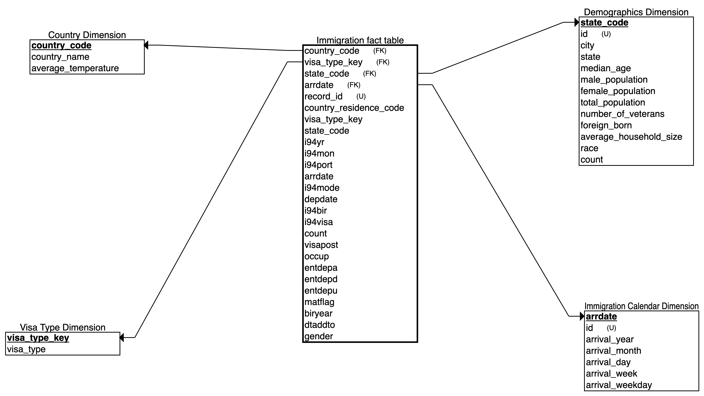

# Data Engineering Capstone Project

## Objective 
The objective of this project was to create an ETL pipeline for I94 immigration, global land temperatures and US demographics datasets to form an analytics database 
on immigration events. A use case for this analytics database is to find immigration patterns to the US. 

## The Project follow the below steps: 
* Step 1: Scope the Project and Gather Data
* Step 2: Explore and Assess the Data
* Step 3: Define the Data Model
* Step 4: Run ETL to Model the Data
* Step 5: Complete Project Write Up

### Step 1: Scope the Project and Gather Data

To create the analytics database, the following steps will be carried out:

* Use Spark to load the data into dataframes.
* Exploratory data analysis of I94 immigration dataset to identify missing values and strategies for data cleaning.
* Exploratory data analysis of demographics dataset to identify missing values and strategies for data cleaning.
* Exploratory data analysis of global land temperatures by city dataset to identify missing values and strategies for data cleaning.
* Perform data cleaning functions on all the datasets.
* Create dimension tables and fact tables.

### Step 2: Explore and Assess the Data
In the notebook, I check the missing and duplicate values in each table and make sure they're all properly addressed. Please refer to the notebook for more
information and details. 

### Step 3: Define the Data Model

* Above we have the Star Schema. We have immigration table in the center, which includes all the information about immigration. Then we have four dimension table. 

* Demographics Table includes all the US demographic information. 

* Calendar Table includes all the arrival time information. 

* Visa Type Table includes all the visa type. 

* Country Table includes country information.

### Step 4: Run ETL to Model the Data
I created each table accordingly and checked their data quality, please refer to the notebook for more details. 

### Step 5: Complete Project Write Up
* Rationale for the choice of tools and technologies for the project Apache spark was used because of:
> It's ability to handle multiple file formats with large amounts of data.
Apache Spark offers a lightning-fast unified analytics engine for big data.

* Propose how often the data should be updated and why.
> The current I94 immigration data is updated monthly, and hence the data will be updated monthly.

Write a description of how you would approach the problem differently under the following scenarios:
* The data was increased by 100x.
> Spark can handle the increase but we would consider increasing the number of nodes in our cluster.
* The data populates a dashboard that must be updated on a daily basis by 7am every day.
> In this scenario, Apache Airflow will be used to schedule and run data pipelines.
* The database needed to be accessed by 100+ people.
> In this scenario, we would move our analytics database into Amazon Redshift.
